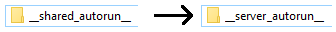

Addon creation tutorial: part 2
===============================

*See the* :doc:`Part 1 <tutorial1>` *if you haven't seen it yet.*

In this tutorial we will improve our "Hello, World" addon a bit.

We will print the "Hello, X!" text to the player's chat instead of the game console, and there will be the player's
nickname in place of "X".

First, rename the ``__shared_autorun__`` folder to ``__server_autorun__``, because we don't need the client to
participate in the "Hello world" printing process. The server will wait for new players and will print "Hello, X!" on
their first spawn.

Then, open the ``__init__.py`` script again.

We have to make two changes here: first, we need to print the text to the chat instead of the game console.
We need to access Garry's Mod Lua somehow. For this purpose, we can use :mod:`gmod.luanamespace` module.
Add this line to the top of the script::

    from gmod.luanamespace import *

Now we can use any Lua function right away.

We will set a ``PlayerInitialSpawn`` hook with a callback which will actually print the greeting.

To do so, we need to call `hook.Add() <http://wiki.garrysmod.com/page/hook/Add>`_ with 3 parameters: the event name,
the hook ID and the callback. Everything is easy with the first two, buh how do we create a callback in Python?
There is a nice function decorator to do so: :func:`gmod.lua.luafunction`.

So, we define our callback::

    from gmod.luanamespace import *
    from gmod.lua import luafunction

    @luafunction                    # <--
    def greet(new_player):          # <--
        print('Hello world!')       # <--

and create a hook::

    from gmod.luanamespace import *
    from gmod.lua import luafunction

    @luafunction
    def greet(new_player):
        print('Hello world!')

    hook.Add('PlayerInitialSpawn', 'greet', greet)  # <--

``Player`` objects have the `ChatPrint() <http://wiki.garrysmod.com/page/Player/ChatPrint>`_ method,
which we can use to print text to their chat. In Lua, it would look like this::

    new_player:ChatPrint('Hello world!')

Notice the colon here. In PyGmod, there is a ``._.`` construction which plays the same role as the colon in Lua.

::

    from gmod.luanamespace import *
    from gmod.lua import luafunction

    @luafunction
    def greet(new_player):
        new_player._.ChatPrint('Hello world!')  # <--

    hook.Add('PlayerInitialSpawn', 'greet', greet)

Now ``Hello world!`` will be printed to the chat. Let's make this greeting personal now: we will greet the player
instead of the world.

Now we get the player's nick with `Nick() <http://wiki.garrysmod.com/page/Player/Nick>`_ method.

::

    from gmod.luanamespace import *
    from gmod.lua import luafunction

    @luafunction
    def greet(new_player):
        new_player._.ChatPrint('Hello, ' + new_player._.Nick() + '!')  # <--

    hook.Add('PlayerInitialSpawn', 'greet', greet)

We're done here. Save and close the script, launch the game, start a new game and look at the chat.

.. image:: addon_tutorial_images/chat_msg.png

=======

You have finished the tutorial and, I hope, you have understood how to make addons with PyGmod.
If you have questions, you can always `get help at our Discord server <https://discord.gg/aAs4qrj>`_.
